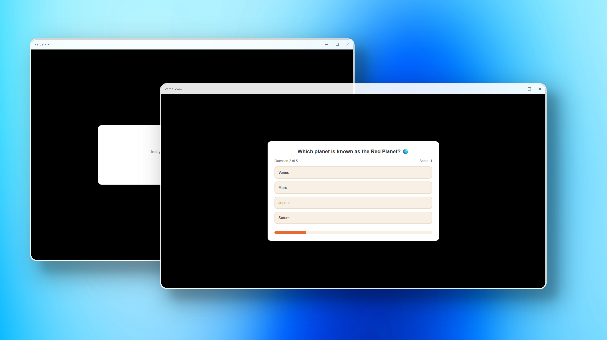

🧠 Quiz App
---
A clean, lightweight quiz application built with vanilla HTML, CSS, and JavaScript.
<p align="center">
  
</p>
---
Description:
Quiz App has 5 multiple-choice questions held in a JavaScript array. Each question provides 4 selectable choices. As the users go through the quiz, the app keeps an eye on their answers in real time—counting correct and incorrect answers. After completing the quiz, users can press "Restart Quiz" to try again. The UI is completely responsive, adjusting well across devices without CSS Grid.
---
**Live Demo**: https://courageous-scone-0ce54e.netlify.app/
**Source Code**: [github.com/your-username/quiz-app](https://github.com/your-username/quiz-app)
---

🎯 What Makes It Great
 1. Compact yet functional: A simple project that demonstrates dynamic question handling, real-time scoring.

 2. Responsive design: Layout adapts to mobile, tablet, and desktop through CSS techniques like Flexbox and media queries.

 3. User-focused flow: Easy-to-follow quiz progression, immediate feedback, and a replay option—ideal for learning and prototyping.

---

## 🎯 Features

- **5 questions** stored in a JavaScript array  
- **4 answer options** per question; select one answer  
- **Live score updates**: tracks correct vs wrong answers  
- **Restart functionality** to replay the quiz  
- **Responsive design** — adapts to mobile and desktop  
- Built with **vanilla HTML, CSS, and JavaScript**

---
## 🛠️ Tech Stack

- **HTML5** – Semantic markup  
- **CSS3** – Responsive design (without CSS Grid)  
- **JavaScript** – Handles quiz logic, user interaction, and score tracking

---
## 🚀 How to Use

1. **Clone the repository**  
   ```bash
   git clone https://github.com/Akash-Biradar/-Quiz-App.git
   cd quiz-app
2. Open index.html in your browser—or use VS Code Live Server for live reload.

    Play the quiz!

    Select an answer for each question.

    Scores update instantly.

    Use Restart Quiz to play again.
